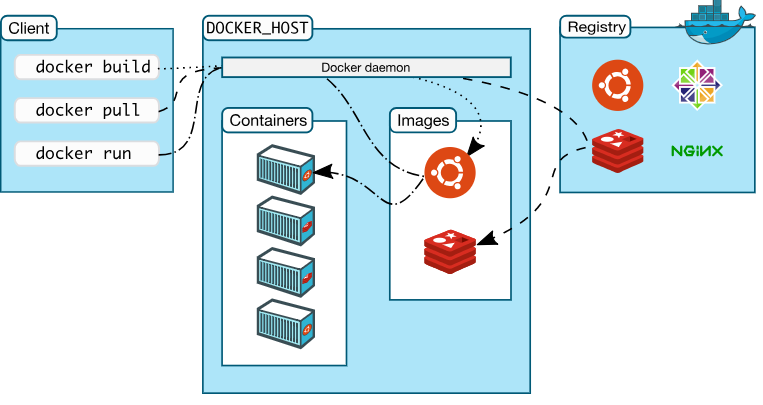
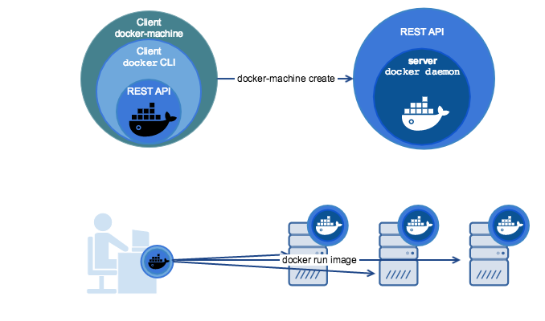
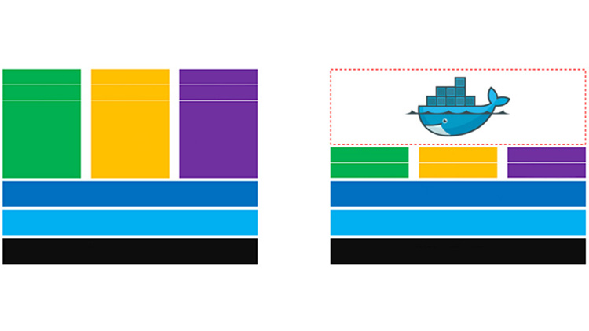
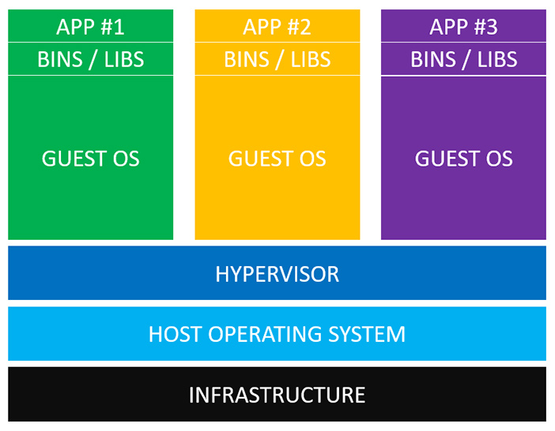
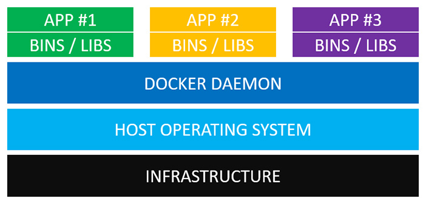

.. _docker-overview:

===================
Docker 简介
===================

Docker 是一个开源的应用容器引擎，基于 Go 语言 并遵从 Apache2.0 协议开源。

Docker 可以让开发者打包他们的应用以及依赖包到一个轻量级、可移植的容器中，然后发布到任何流行的 Linux 机器上，也可以实现虚拟化。

容器是完全使用沙箱机制，相互之间不会有任何接口（类似 iPhone 的 app），更重要的是容器性能开销极低。

Docker Engine
==============

Docker 引擎（Engine）基于 client-server 架构，主要包括以下组件：

- **Server**： 一个持续运行的守护进程（``dockerd`` 命令）
- **REST API**：用于与守护进程交互
- **Client**：命令行客户端（``docker`` 命令）， 也是使用 REST API 与 Server 交互

.. image:: images/engine-components-flow.png
   :align: center

Docker 架构
=========================

.. image:: images/docker-architecture2.png
   :align: center

Docker 镜像（Images）
    Docker 镜像是用于创建 Docker 容器的模板。

Docker 容器（Container）
    容器是独立运行的一个或一组应用。

Docker 客户端（Client）
    Docker 客户端通过命令行或者其他工具使用 `Docker API <https://docs.docker.com/reference/api/docker_remote_api>`_ 与 Docker 的守护进程通信。

Docker 主机（Host）
    一个物理或者虚拟的机器用于执行 Docker 守护进程和容器。

Docker 仓库（Registry）
    Docker 仓库用来保存镜像，可以理解为代码控制中的代码仓库。`Docker Hub <https://hub.docker.com>`_ 提供了庞大的镜像集合供使用。

Docker Machine
    Docker Machine是一个简化 Docker 安装的命令行工具，通过一个简单的命令行即可在相应的平台上安装 Docker，比如VirtualBox、 Digital Ocean、Microsoft Azure。

容器（container）与镜像（image）的关系类似于面向对象编程中的对象与类。关于 Container 和 Image 的具体概念，参考 :ref:`Dockerfile 入门指南 <dockerfile-tutorial>`。

Docker 容器与虚拟机差别
=========================

使用虚拟机运行多个相互隔离的应用时，如下图：

从下到上理解上图：

- **基础设施** （Infrastructure）

    可以是你的个人电脑、数据中心的服务器，或者是云主机。

- **主操作系统** （Host Operating System）

    你的个人电脑之上，运行的可能是 MacOS，Windows 或者某个 Linux 发行版。

- **虚拟机管理系统** （Hypervisor）

    利用 Hypervisor， 可以在主操作系统之上运行多个不同的从操作系统。Hypervisor 有支持 MacOS 的 HyperKit，支持 Windows 的 Hyper-V 以及支持 Linux 的 KVM；还有 VirtualBox 和 VMWare。

- **从操作系统** （Guest Operating System）

    假设你需要运行 3 个相互隔离的应用，则需要使用 Hypervisor 启动 3 个从操作系统，也就是 3 个虚拟机。这些虚拟机都非常大，也许有 700MB，这就意味着它们将占用 2.1GB 的磁盘空间。更糟糕的是， 它们还会消耗很多 CPU 和内存。

- **各种依赖**

    每一个从操作系统都需要安装许多依赖。如果你的的应用需要连接 PostgreSQL 的话，则需要安装 libpq-dev；如果你使用 Ruby 的话，应该需要安装 gems；如果使用其他编程语言，比如 Python 或者 Node.js，都会需要安装对应的依赖库。
- **应用**

    安装依赖之后，就可以在各个从操作系统分别运行应用了，这样各个应用就是相互隔离的。

使用 Docker 容器运行多个相互隔离的应用时， 如下图：

相比于虚拟机，Docker 要简洁很多，因为我们不需要运行一个臃肿的从操作系统了。从下到上理解上图：

- **基础设施**

- **主操作系统**

    所有主流的操作系统都可以运行 Docker。

- **Docker 守护进程** （Docker Daemon）

    Docker 守护进程取代了 Hypervisor，它是运行在操作系统之上的后台进程，负责管理 Docker 容器。

- **各种依赖**

    对于 Docker，应用的所有依赖都打包在 Docker 镜像中，Docker 容器是基于 Docker 镜像创建的。

- **应用**

    应用的源代码与它的依赖都打包在 Docker 镜像中，不同的应用需要不同的Docker镜像。不同的应用运行在不同的 Docker 容器中，它们是相互隔离的。

Docker 守护进程可以直接与主操作系统进行通信，为各个 Docker 容器分配资源。它还可以将容器与主操作系统隔离，并将各个容器互相隔离。虚拟机启动需要数分钟，而 Docker 容器可以在数毫秒内启动。由于没有臃肿的从操作系统，Docker 可以节省大量的磁盘空间以及其他系统资源。

.. image:: images/vm-vs-docker2.jpg

Docker 优点
====================

1. 简化程序：

    Docker 让开发者可以打包他们的应用以及依赖包到一个可移植的容器中，然后发布到任何流行的 Linux 机器上，便可以实现虚拟化。Docker改变了虚拟化的方式，使开发者可以直接将自己的成果放入Docker中进行管理。方便快捷已经是 Docker的最大优势，过去需要用数天乃至数周的	任务，在Docker容器的处理下，只需要数秒就能完成。

2. 避免选择恐惧症：

    如果你有选择恐惧症，还是资深患者。Docker 帮你	打包你的纠结！比如 Docker 镜像；Docker 镜像中包含了运行环境和配置，所以 Docker 可以简化部署多种应用实例工作。比如 Web 应用、后台应用、数据库应用、大数据应用比如 Hadoop 集群、消息队列等等都可以打包成一个镜像部署。

3. 节省开支：

    一方面，云计算时代到来，使开发者不必为了追求效果而配置高额的硬件，Docker 改变了高性能必然高价格的思维定势。Docker 与云的结合，让云空间得到更充分的利用。不仅解决了硬件管理的问题，也改变了虚拟化的方式。

Docker 应用场景
===================

虚拟机更擅长于彻底隔离整个运行环境，例如云服务提供商通常采用虚拟机技术隔离不同的用户；而 Docker 通常用于隔离不同的应用，如：

- Web 应用的自动化打包和发布。

- 自动化测试和持续集成、发布。

- 在服务型环境中部署和调整数据库或其他的后台应用。

